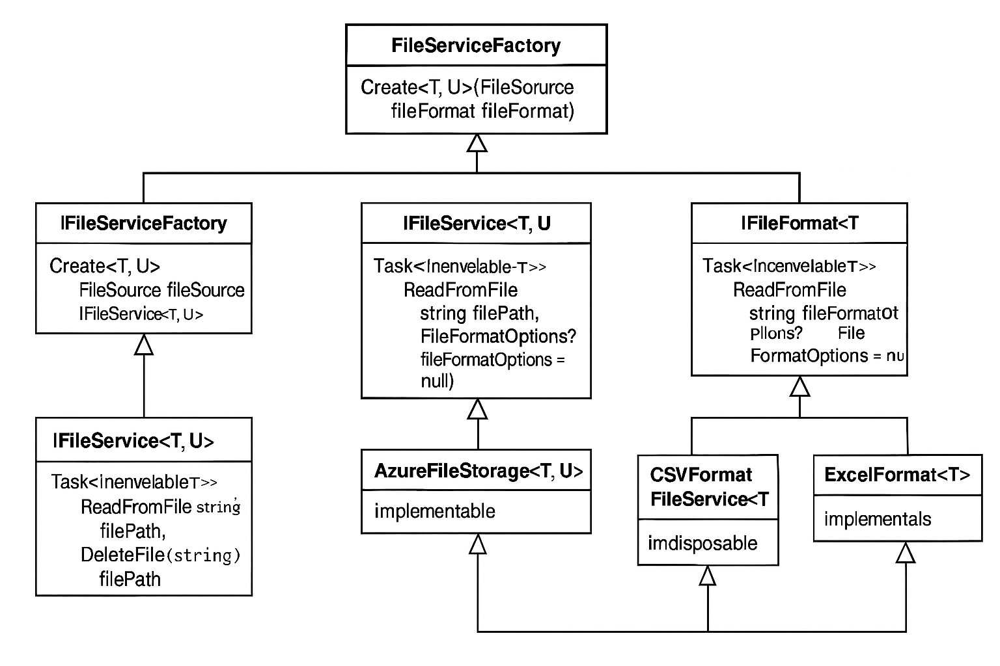

# Orchware-public

## Reference to the private Orchware repo—core foundation of this project.

_"Limited access to the core code may mean some functionalities are not directly visible here."_

## Live Demo

Orchware is a warehouse management system built using Angular (frontend) and ASP.NET (backend), containerized with Docker and deployed via GitHub Actions.  

🌐 **Live app:** [https://viktor-showcase.dev/orchware](https://viktor-showcase.dev/orchware)

:book: **PDF Documentation**
[Orchware_Description.pdf](https://eu2.contabostorage.com/2efd0461225649f1ab046e9a2f8101ca:vikstr/documents/Orchware_Description.pdf)            
A detailed description of the system's business logic, design, and development process.

----

## 🚧 Current Status – Work in Progress

The project is actively under development and already includes key features such as:

- 🛒 **Frontoffice**: Product browsing  
- 📦 **Backoffice**: Inventory management

The core architecture is in place, and new features are added continuously.  
The app is live, and updates are delivered in real time via a CI/CD pipeline.

💬 _Feedback and suggestions are always welcome!_

  

---

### 🧱 Tech Stack

   

---

### ⚙️ Deployment & CI/CD

  [](https://viktor-showcase.dev/orchware)

---

### 📊 Repository Stats

**About This Repository**
This is a public reference of the Orchware project, primarily intended for showcasing the live application and giving insight into the architecture.

🔒 The core development activity (including **CI/CD** pipelines, detailed configuration, project management, and full issue tracking) is maintained in a private repository.

This public version is configured slightly differently — just enough to run the app locally or explore how it works.
The source code here is 99% identical to the private repo, with only minor adjustments made for deployment and security reasons. 

 

----------

📦 **Orchware System**  
**Orchware** is a system for managing **Backoffice and Frontoffice services**, built on **.NET 8** with a focus on **clean and modular architecture**.  
It handles **inventory, orders, and shipping operations**, using modern **DDD**, **Vertical Slice Architecture**, and a **Common Library** for shared functionalities.  

## 📑 **Table of Contents**  
🔹 [Business Overview](#business-overview)    
🔹 [Business Logic & Order Flow](#business-logic)   
🔹 [Technologies Used](#technologies-used)  
🔹 [Project Structure](#project-structure)  
🔹 [Setup Instructions](#setup-instructions)  
🔹 [Common Libraries](#common-libraries)  
🔹 [Docker Support](#docker-support)  
🔹 [Contributing](#contributing)  

---

## 📌 **Business Overview**

**Orchware** is a portfolio project designed to simulate real-world fruit warehouse operations with a structured, modular architecture. Unlike traditional monolithic or microservices approaches, Orchware balances scalability, flexibility, and maintainability through a clear Backoffice & Frontoffice separation.          
🔹 **Backoffice Service** – Manages inventory, orders, payments, and warehouse logistics           
🔹 **Frontoffice Service** – Provides customer access to products, order requests, and company registration.          
🔹 **Common Libraries** – Shared utilities for file handling, structured SQL queries, and validation.           
This system allows fruit wholesalers to efficiently manage ordering, storage, and distribution operations, ensuring streamlined workflows from order creation to final shipment


---

## 🚀 Business Logic & Order Flow

### 👤 Roles in Orchware        
📌 Manager: Oversees customer orders, inventory shortages, payment tracking, and approvals.  
📌 Warehouseman: Packs, loads, and ensures shipments are prepared for transport.      
🛠 Order Lifecycle & Statuses    

1️⃣ Customer selects products → Pending Order

2️⃣ Order request sent → Status: Requested

3️⃣ Manager confirms availability → Status: Confirmed

4️⃣ Warehouse processes shipment → Status: Assigned to Warehouse / In Preparation

5️⃣ Products packed → Status: Awaiting Dispatch

6️⃣ Shipment begins → Delivery Stage

7️⃣ Customer receives order → Completed

## 🚨 Cancellation & Payment Rules:   

❌ Orders can be canceled before loading into transport unless payment is delayed.       
✅ Customers must pay within 3 days or provide a guarantee; otherwise, the shipment is canceled.


---

## 📋 **Technical Overview**  

### **Backoffice**  
✅ Built using **Clean Architecture** and **Domain-Driven Design (DDD)** principles.  
✅ Manages entities like **Products, Shelves, Orders**.  
✅ Supports **database seeding, migrations, and file storage**.  
✅ Uses **Entity Framework Core, Dapper** as ORM.  

### **Frontoffice**  
✅ Built with **Vertical Slice Architecture** for modularity.  
✅ Focused on exposing **product API (GET/Pagination/Filters)**.  
✅ Uses **Entity Framework Cor & Dapper** for efficient database access.  
✅ Supports **pagination and filtering** out of the box.  

---

## 🛠️ **Technologies Used**  
✔ **.NET 8**  
✔ **Entity Framework Core** (ORM)  
✔ **Dapper** (ORM)
✔ **MediatR** (Commands, Queries, Domain Events [Notifications])  
✔ **FluentValidation** (Dto Models and Command Request Validations)  
✔ **CsvHelper** (CSV import/export)  
✔ **Docker** (containerization)  

---

## 🏗 **Project Structure**  

```plaintext
src/
│
├── Backoffice/
│   ├── Orchware.Backoffice.API           → Web API for Backoffice operations
│   ├── Orchware.Backoffice.Application   → Business logic and use cases
│   ├── Orchware.Backoffice.Domain        → Core domain entities
│   └── Orchware.Backoffice.Infrastructure → EF Core, file storage, seeding
│
├── Frontoffice/
│   ├── Orchware.Frontoffice.API           → API for product data
│   └── Infrastructure                     → Dapper context, database access
│
├── Common/
│   ├── FileStorage                        → Abstractions for file handling (CSV, Excel, Azure)
│   └── DbQueryBuilder                     → Fluent API for SQL queries with Dapper
```

---

## ⚙️ **Setup Instructions**  
🔹 **Prerequisites:**  
✅ **.NET 8 SDK**  
✅ **Docker** (optional, for containerized deployment)  

### **Running the system**  

## 🚀 Quick Start  

**Clone the repository**  
```bash
git clone https://github.com/your-repo/orchware.git
cd orchware run
```

**Setup Dependency** 
```Bash
dotnet restore
```
**Run the Services** 
```Bash
dotnet run --project src/Backoffice/Orchware.Backoffice.API
dotnet run --project src/Frontoffice/Orchware.Frontoffice.API
```
---

## 📦 **Common Libraries**  

✅ Manages **file operations** across services:  

- **File Format:** `["CSV", "Excel", "other file types..."]`  
- **File Source:** `["Local", "Azure", "other file storages..."]`  


🏗 **Design Patterns**

| Pattern | Where You Use It | Explanation |
|:---|:---|:---|
| **Factory Method Pattern** | `FileServiceFactory.Create<T, U>()` | The `Create` method decides at runtime which specific implementation of `IFileService<T, U>` to instantiate, depending on the `FileSource` and `FileFormat`. |
| **Abstract Factory Pattern** | The `FileServiceFactory` as a whole | `FileServiceFactory` acts as a factory that creates related objects (`LocalFileStorage`, `AzureFileStorage`, etc.) without knowing their specific types in advance. |
| **Dependency Injection (DI)** | Usage of `IServiceScopeFactory`, `IServiceProvider` | All services (`LocalFileStorage`, `CSVFormatFileService`, etc.) are registered in the DI container, and the factory retrieves them via `IServiceProvider`. |
| **Strategy Pattern** | `IFileFormat<T>` implementations (`CSVFormatFileService`, `ExcelFormatFileService`) | Different file formats (CSV, Excel) represent different strategies for reading files. |
| **Disposable Pattern** | `Dispose` implementations in `LocalFileStorage`, `AzureFileStorage`, `CSVFormatFileService`, etc. | All services properly implement `IDisposable` to release unmanaged resources. |
| **Decorator Pattern (optional)** | Using a `DisposableWrapper` around service and scope | The object is "decorated" to add extra cleanup logic for the scope when the object itself is disposed. |

## UML Diagram



## Example where it is referenced in the project

_OrchwareBackInitializer_
```
line 79

private IEnumerable<T> GetDataFromFile<T>(string filename) where T : class, new()
{
	var filePath = GetSeederFilePath(filename);
	var fileService = _fileServiceFactory.Create<T,CSVFormatFileService<T>>(FileSource.Local, FileFormat.CSV);
	return fileService.ReadFromFile(filePath).Result;
}
```

_OrchwareBack Registration_
```
namespace Orchware.Backoffice.Infrastructure.Persistence;

class PersistenceServiceRegistration

  ...

services.AddFileServices();
```

### **DbQueryBuilder**  
✅ Fluent API for dynamic SQL queries using **Dapper, ADO .NET**.

🏗 **Design Patterns**
- Use **Builder Pattern (Fluent Interface)** for easy and secure SQL building queries.

### Table

| Pattern | Description |
|:----|:-----|
| **Design Pattern** | Builder Pattern (Fluent Builder) |
| **Purpose** | Constructing **SQL** queries step-by-step in an easy and safe way |
| **Interface** | `ISqlQueryBuilder` defines the steps that can be called |
| **Implementation** | `SqlQueryBuilder` builds the final **SQL** statement with `Build()` method |
| **Benefits** | - Easy code reading <br> - Reducing SQL syntax errors <br> - Chainable API or a flexible combination of conditions |
| **Call Example** | `builder.Select("*").From("Users").Where("Age > 18").OrderBy("Name").Build();` |

---

### Using Example

```csharp
var query = new SqlQueryBuilder()
    .Select("*")
    .From("Users")
    .Where("IsActive = 1")
    .OrderBy("CreatedDate", ascending: false)
    .Build();
    
// query:
// SELECT * 
// FROM Users 
// WHERE IsActive = 1 
// ORDER BY CreatedDate DESC

```

---

## 🐳 **Docker Support**  
✅ **Docker** is supported for easier deployment.  

---

### 🚀 Upcoming Features  
- **Notification Service** – Currently in early development. Will handle **event tracking and real-time notifications** via SignalR.  
- **Email Service or Azure Integration** – Planned but not yet started.  
- **Frontend with Angular** – The system will have an Angular-based UI for interacting with Backoffice and Frontoffice APIs.   
- **Keycloak for Authentication & Authorization** – Planned integration for secure **identity management**.  
 
---

### Why is this not a microservices or monolyth architecture?  

This project currently consists of two services:  
- **Backoffice** service  
- **Frontoffice** service  

A **Notification Service** is planned as an intermediary to handle event tracking and send real-time notifications via **SignalR** to the frontend. Additionally, there is potential for an **Email Service** or integration with **Azure Services**, such as:  
- **Azure Functions**  
- **Logic Apps**  
- **Azure Blob Storage** for file management  

The reason this project does **not** follow a microservices architecture is that its primary goal is to be part of my portfolio for job applications a production-ready system, but I don't expect high volume of users. However, microservices offer several advantages, such as:  
- **Scalability** – Each service can scale independently based on demand  
- **Technology Flexibility** – Different services can use different tech stacks without dependencies  
- **Fault Isolation** – Failure in one service does not necessarily impact the entire system  

Despite not being a full monolithic structure, this project follows a **modular approach**, allowing me to demonstrate expertise in **event-driven architecture, cloud-based solutions, and multi-service interaction**. This strategy showcases a practical application of modern system design while maintaining simplicity for portfolio purposes.  

## Articles & Publications

- [System Designed from My Own Experience](https://www.linkedin.com/pulse/system-designed-from-my-own-experience-viktor-zafirovski-ez7wf) – An article where I share insights on software system design based on real-world experience.

## License

[MIT](https://github.com/vik37/Orchware-Public/blob/main/LICENSE.txt)

----------------------------------------------------------           

# NEWS:

## 🆕 What's New

### 🔍 Enhanced Search and Filtering Support

The following improvements were added to support more dynamic and safe SQL filtering scenarios:

- ✅ **SearchTerm Support**: You can now pass a `SearchTerm` (e.g., `"Ap"`) to filter rows where a product name starts with the given string. This is dynamically appended as a `WHERE` condition (e.g., `[Name] LIKE @SearchTerm + '%'`).
- ✅ **MultiFilter Integration**: `MultiFilter` accepts multiple key-value-condition-based filters (JSON array), validated using existing permission and safety rules.
- ✅ **Combined Filtering Logic**: Supports combining `Filter`, `SearchTerm`, and `MultiFilter` in a safe way inside stored procedures.
- ✅ **SQL Injection Protection**: All dynamic conditions are passed through `SqlExpressionValidator`, which relies on field-level permission rules to ensure only safe conditions are applied.
- ✅ **Fallbacks for Ordering**:
  - `OrderBy`: Defaults to `"Id"` if not supplied.
  - `OrderDirection`: Defaults to `"ASC"` and must be `"ASC"` or `"DESC"`.

  ------------------------------------

  ### 🔐 Permissions Layer

- `IFieldPermissionProvider.cs`  
  Interface that defines which fields and conditions are allowed to be used in the `WHERE` clause.

- `SqlExpressionValidator.cs`  
  Validates `FilterKeyValue` objects against defined permissions.  
  ➕ **Now supports `MultiFilter` logic (JSON array with multiple filters)**  
  ➕ **Adds support for safe `SearchTerm` integration into the final `WHERE` clause**  
  ➕ **Validation is strict — if a filter is unsafe, `UnsafeSqlFilterException` is thrown**  
  ➕ **Combining `Filter`, `MultiFilter`, and `SearchTerm` is now fully supported and secure**

- `UnsafeSqlFilterException.cs`  
  Custom exception thrown when an unsafe SQL filter is detected.

  ## 🔄 Backoffice Updates

### 🆕 Added API endpoints for inventory management:

- `GET api/inventory/shelf/{id}` – Retrieve details of a specific shelf and its products.
- `GET api/inventory/seasonal-fruits` – Get a list of seasonal fruits.
- `GET api/inventory/units-of-measure` – Fetch available units of measure for products.
- `GET api/inventory/shelf` – Get Shelf Description including brief details of the products (name and quantity) .

  ## 🔄 Middleware Enhancements in Backoffice & Frontoffice

### ✅ **Exception Handling Middleware**
- **Unified Error Responses:** Both services now implement `ExceptionMiddleware` to standardize error handling.
- **Logging & Debugging Improvements:** Middleware captures request details, headers, and correlation IDs for better troubleshooting.
- **Supported Exceptions:** Handles **BadRequestException**, **NotFoundException**, and unexpected server errors.
- **Consistent API Responses:** Ensures all errors return structured responses following **RFC 7807 problem+json format**.


