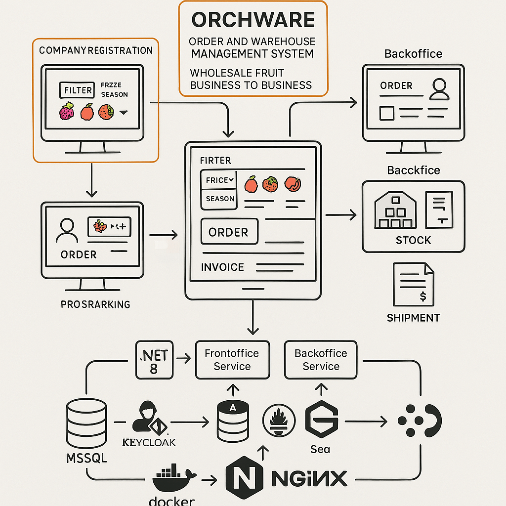
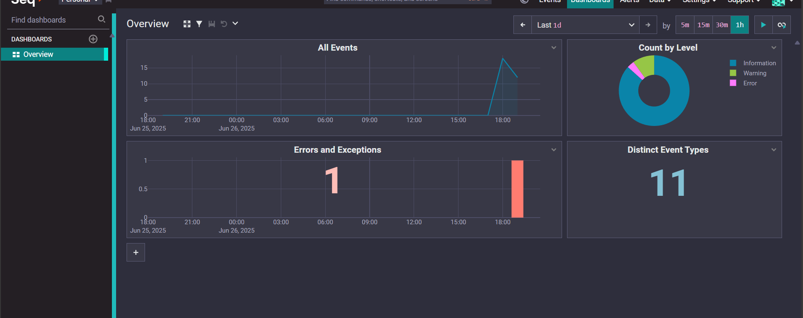
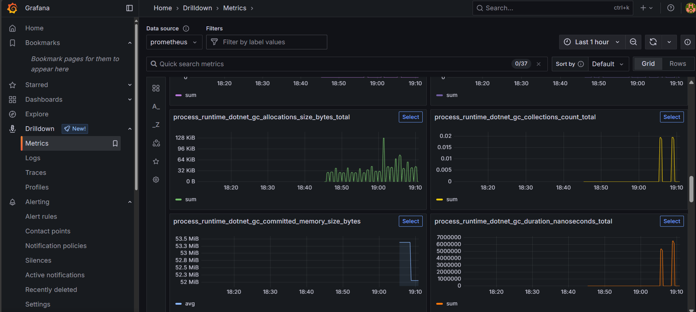
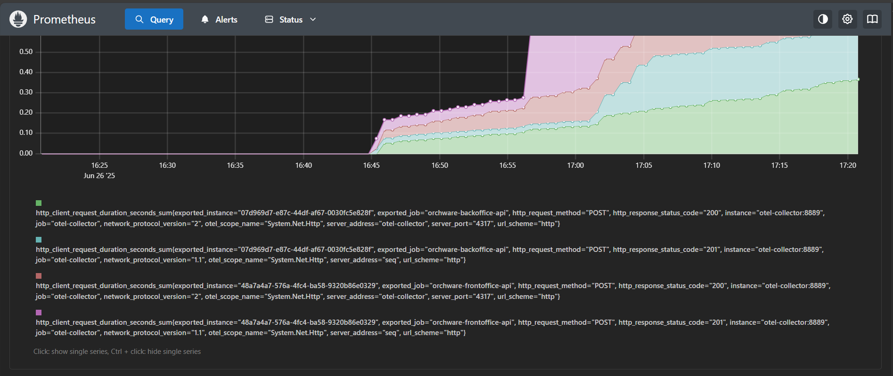

# Orchware-public

## Reference to the private Orchware repo—core foundation of this project.

_"Limited access to the core code may mean some functionalities are not directly visible here."_

## Live Demo

Orchware is a warehouse management system built using Angular (frontend) and ASP.NET (backend), containerized with Docker and deployed via GitHub Actions.  

🌐 **Live app:** [https://viktor-showcase.dev/orchware](https://viktor-showcase.dev/orchware)

:book: **PDF Documentation**
[Orchware_Description.pdf](https://eu2.contabostorage.com/2efd0461225649f1ab046e9a2f8101ca:vikstr/documents/Orchware_Description.pdf)       
A detailed description of the system's business logic, design, and development process.

----

## 🚧 Current Status – Work in Progress

The project is actively under development and already includes key features such as:

- 🛒 **Frontoffice**: Product browsing  
- 📦 **Backoffice**: Inventory management

The core architecture is in place, and new features are added continuously.  
The app is live, and updates are delivered in real time via a CI/CD pipeline.

💬 _Feedback and suggestions are always welcome!_

  

---

### 🧱 Tech Stack

    
     

---

### ⚙️ Deployment & CI/CD

  [](https://viktor-showcase.dev/orchware) 


---

### Authentication & Authorization (Keycloak Integration)

This project leverages robust **Authentication and Authorization** mechanisms to secure its services and manage user access. For this purpose, I've chosen to implement **Keycloak**, an open-source Identity and Access Management solution, primarily for its capabilities in providing **Single Sign-On (SSO)** across various applications.

To simplify setup and demonstrate the system's security features, you can easily import the pre-configured Keycloak Realm.

#### Quick Keycloak Setup:

1.  **Start Keycloak:** Ensure your Keycloak instance is running (e.g., via Docker Compose).
2.  **Import Realm Configuration:**
    * Navigate to your Keycloak Admin Console (e.g., `http://localhost:8080/admin`).
    * Click on **"Add Realm"** (or **"Create Realm"**).
    * Select the **"Import realm"** option and upload the `keycloak-config/orchware-dev-realm.json` file from this repository.

    **📺 For a step-by-step visual guide on importing the JSON, watch this video:**
    [Import JSON file to Keycloak example](http://www.youtube.com/watch?v=XpHxA46w9F4)
 
    - File location: `keycloak_json/realm-export.json`

    * **For quick testing, you can create the following demo users with pre-defined roles:**
        * **manager:**
            * Username: `manager@orchware.com`
            * Password: `manDemo123!`
            * Roles: Ensure this user is assigned the `manager` role (and potentially `user` if needed for general access).
        * **warehouseman:**
            * Username: `warehouse@orchware.com`
            * Password: `Whouseman123!`
            * Roles: Ensure this user is assigned the `warehouseman` role (and potentially `user`).
        * **(Optional) Regular User:**
            * **You can register a new user directly through the application's UI.** Any new user registered this way will automatically be assigned the `user` role.

* **Important Notes for Keycloak Setup:**
       - **Users and Client Secrets:** When exporting and then importing Keycloak Realm JSON, user accounts and client secrets _(confidential clients)_ are not included. They need to be added manually, as shown in the video. _(I'm not fully certain why this is the default behavior or if there's a specific export option to include them, and it's something I plan to investigate further.)_

#### Authorization Policies in Backend (.NET)

The backend (`Orchware.Frontoffice.API`) implements custom authorization policies to manage access based on user roles from Keycloak. A key example is the `NonEmployeeUser` policy:

```csharp
builder.Services.AddAuthorization(opt => {
    opt.AddPolicy("NonEmployeeUser", policy =>
    {
        policy.RequireAssertion(ctx =>
        {
            var roles = ctx.User.FindAll(ClaimTypes.Role).Select(r => r.Value);
            var hasUserRole = roles.Contains("user");
            var isEmployee = roles.Any(r => new[] { "manager", "warehouseman" }.Contains(r));

            return hasUserRole && !isEmployee;
        });
    });
});
```     

### Keycloak Configuration Example for Production

For production, Keycloak typically runs behind a reverse proxy (like NGINX or Traefik) that handles HTTPS/SSL termination. The Keycloak `command` and environment variables need to reflect this.

Here’s an example of how the Keycloak service within your `docker-compose.yml` might look for a production setup:

```yaml
keycloak:
  image: quay.io/keycloak/keycloak:24.0 # Or your specific production image
  container_name: keycloak # Or a more descriptive name
  command: start # Important: Use 'start' for production, not 'start-dev'
  environment:
    KC_DB: postgres
    KC_DB_URL_HOST: your-production-db-host # Point to your external production DB
    KC_DB_URL_DATABASE: keycloak
    KC_DB_USERNAME: keycloak
    KC_DB_PASSWORD: your-secure-db-password! # Use a strong, secure password
    KEYCLOAK_ADMIN: admin
    KEYCLOAK_ADMIN_PASSWORD: your-secure-admin-password! # Use a strong, secure password
    KC_HTTP_ENABLED: false # Keycloak listens for HTTP but expects a proxy to handle HTTPS
    KC_HOSTNAME: auth.your-domain.com # Replace with your actual authentication subdomain
    KC_PROXY: edge # Tells Keycloak it's behind a reverse proxy
    # Add other production-specific environment variables as needed
  # ports: # Do NOT expose ports directly to host in production; let proxy handle it
  #   - "8080:8080" # Remove or comment out this line in production
  # volumes: # Adjust volumes for persistent data and backups
  #   - keycloak_data:/opt/keycloak/data
  # depends_on: # If using an external DB, this might change
  #   keycloak-db:
  #     condition: service_healthy
  restart: unless-stopped # Ensure Keycloak restarts if it crashes
  ```

### 🔐 Authentication is handled by Keycloak:  
[https://auth.viktor-showcase.dev](https://auth.viktor-showcase.dev)  
_(Admin access is not publicly exposed)_


---

### 📊 Repository Stats

**About This Repository**
This is a public reference of the Orchware project, primarily intended for showcasing the live application and giving insight into the architecture.

🔒 The core development activity (including **CI/CD** pipelines, detailed configuration, project management, and full issue tracking) is maintained in a private repository.

This public version is configured slightly differently — just enough to run the app locally or explore how it works.
The source code here is 99% identical to the private repo, with only minor adjustments made for deployment and security reasons. 


----------

📦 **Orchware System**  
**Orchware** is a system for managing **Backoffice and Frontoffice services**, built on **.NET 8** with a focus on **clean and modular architecture**.  
It handles **inventory, orders, and shipping operations**, using modern **DDD**, **Vertical Slice Architecture**, and a **Common Library** for shared functionalities.  

## 📑 **Table of Contents**  
🔹 [Business Overview](#-business-overview)    
🔹 [Business Logic & Order Flow](#-business-logic--order-flow)   
🔹 [Cancellation & Payment Rules](#-cancellation--payment-rules)  
🔹 [Technical Overview](#-technical-overview)        
🔹 [Technologies Used](#technologies-used)    
🔹 [Project Structure](#-project-structure)  
🔹 [Setup Instructions](#setup-instructions)  
🔹 [Quick Start](#-quick-start)    
🔹 [Common Libraries](#-common-libraries)  
🔹 [UML Diagram](#uml-diagram)  
🔹 [Docker Support](#-docker-support)  
🔹 [Upcoming Features](#-upcoming-features)    
🔹 [Additional Context](#additional-context)  
🔹 [Articles & Publications](#articles--publications)  
🔹 [License](#license)  
| 🔹 [What's New](#news)                                                                                                     |
|-----------------------------------------------------------------------------------------------------------------------------|
|   :arrow_right_hook: [Backoffice Updates](#-backoffice-updates)                                                             |
|=============================================================================================================================|
|   :arrow_right_hook: [Observability: Monitoring & Tracing](#completed-feature---06302025)                                   |
|=============================================================================================================================|
|   :arrow_right_hook: [Introduce a comprehensive Company Registration and Management Module](#completed-feature---08282025)  |
|=============================================================================================================================|
-------------------------------------------------------------------------------------------------------------------------------
---

## 📌 **Business Overview**

**Orchware** is a portfolio project designed to simulate real-world fruit warehouse operations with a structured, modular architecture. Unlike traditional monolithic or microservices approaches, Orchware balances scalability, flexibility, and maintainability through a clear Backoffice & Frontoffice separation.          
🔹 **Backoffice Service** – Manages inventory, orders, payments, and warehouse logistics           
🔹 **Frontoffice Service** – Provides customer access to products, order requests, and company registration.          
🔹 **Common Libraries** – Shared utilities for file handling, structured SQL queries, and validation.           
This system allows fruit wholesalers to efficiently manage ordering, storage, and distribution operations, ensuring streamlined workflows from order creation to final shipment


---

## 🚀 Business Logic & Order Flow

### 👤 $${\color{green} Roles \space in \space Orchware}$$        
> Manager: Oversees customer orders, inventory shortages, payment tracking, and approvals.  
> Warehouseman: Packs, loads, and ensures shipments are prepared for transport.      
> Order Lifecycle & Statuses    

1️⃣ Customer selects products → Pending Order

2️⃣ Order request sent → Status: Requested

3️⃣ Manager confirms availability → Status: Confirmed

4️⃣ Warehouse processes shipment → Status: Assigned to Warehouse / In Preparation

5️⃣ Products packed → Status: Awaiting Dispatch

6️⃣ Shipment begins → Delivery Stage

7️⃣ Customer receives order → Completed

## 🚨 **Cancellation & Payment Rules**:   

❌ Orders can be canceled before loading into transport unless payment is delayed.       
✅ Customers must pay within 3 days or provide a guarantee; otherwise, the shipment is canceled.


---

## 📋 **Technical Overview**  

### - $${\color{red}Backoffice}$$  
✅ Built using **Clean Architecture** and **Domain-Driven Design (DDD)** principles.  
✅ Manages entities like **Products, Shelves, Orders**.  
✅ Supports **database seeding, migrations, and file storage**.  
✅ Uses **Entity Framework Core, Dapper** as ORM.  

### - $${\color{red}Frontoffice}$$ 
✅ Built with **Vertical Slice Architecture** for modularity.  
✅ Focused on exposing **product API (GET/Pagination/Filters)**.  
✅ Uses **Entity Framework Cor & Dapper** for efficient database access.  
✅ Supports **pagination and filtering** out of the box.  
✅ Redis integration planned for future caching and performance optimization.          
:curly_loop: $${\color{blue} \Redis - is - currently - used - for - \draft (Company - Feature), with - caching - planned - for - future - performance - tuning.}$$

---

## Technologies Used
✔ **.NET 8**  
✔ **Entity Framework Core** (ORM)  
✔ **Dapper** (ORM)
✔ **MediatR** (Commands, Queries, Domain Events [Notifications])  
✔ **FluentValidation** (Dto Models and Command Request Validations)  
✔ **CsvHelper** (CSV import/export)  
✔ **Docker** (containerization)  
✔ **OpenTelemetry** (distributed tracing & metrics instrumentation)
✔ **OTel Collector** (centralized observability pipeline)
✔ **Seq** (structured log ingestion & visualization)
✔ **Grafana** (dashboarding and alerting)
✔ **Tempo** (distributed trace backend)
✔ **Prometheus** (metrics scraping & backend)                   
✔ **Keycloak** (Authentication/Authorization, Single Sign On, OAuht, OIDC)                    
✔ **Redis** (In-memory distributed cache — currently used for draft storage to reduce DB load and improve responsiveness; caching layer planned for broader performance optimization)

 


---

## 🏗 **Project Structure**  

```plaintext
src/
│
├── Backoffice/
│   ├── Orchware.Backoffice.API           → Web API for Backoffice operations
│   ├── Orchware.Backoffice.Application   → Business logic and use cases
│   ├── Orchware.Backoffice.Domain        → Core domain entities
│   └── Orchware.Backoffice.Infrastructure → EF Core, file storage, seeding
│
├── Frontoffice/
│   ├── Orchware.Frontoffice.API           → API for product data
│   └── Infrastructure                     → Dapper context, database access
│
├── Common/
│   ├── FileStorage                        → Abstractions for file handling (CSV, Excel, Azure)
│   └── DbQueryBuilder                     → Fluent API for SQL queries with Dapper
```

---

## Setup Instructions  
🔹 **Prerequisites:**  
✅ **.NET 8 SDK**  
✅ **Docker** (optional, for containerized deployment)  

### **Running the system**  

## 🚀 Quick Start  

**Clone the repository**  
```bash
git clone https://github.com/your-repo/orchware.git
cd orchware run
```

**Setup Dependency** 
```Bash
dotnet restore
```
**Run the Services** 
```Bash
dotnet run --project src/Backoffice/Orchware.Backoffice.API
dotnet run --project src/Frontoffice/Orchware.Frontoffice.API
```
---

## 📦 **Common Libraries**  

✅ Manages **file operations** across services:  

- **File Format:** `["CSV", "Excel", "other file types..."]`  
- **File Source:** `["Local", "Azure", "other file storages..."]`  


🏗 **Design Patterns**

| Pattern | Where You Use It | Explanation |
|:---|:---|:---|
| **Factory Method Pattern** | `FileServiceFactory.Create<T, U>()` | The `Create` method decides at runtime which specific implementation of `IFileService<T, U>` to instantiate, depending on the `FileSource` and `FileFormat`. |
| **Abstract Factory Pattern** | The `FileServiceFactory` as a whole | `FileServiceFactory` acts as a factory that creates related objects (`LocalFileStorage`, `AzureFileStorage`, etc.) without knowing their specific types in advance. |
| **Dependency Injection (DI)** | Usage of `IServiceScopeFactory`, `IServiceProvider` | All services (`LocalFileStorage`, `CSVFormatFileService`, etc.) are registered in the DI container, and the factory retrieves them via `IServiceProvider`. |
| **Strategy Pattern** | `IFileFormat<T>` implementations (`CSVFormatFileService`, `ExcelFormatFileService`) | Different file formats (CSV, Excel) represent different strategies for reading files. |
| **Disposable Pattern** | `Dispose` implementations in `LocalFileStorage`, `AzureFileStorage`, `CSVFormatFileService`, etc. | All services properly implement `IDisposable` to release unmanaged resources. |
| **Decorator Pattern (optional)** | Using a `DisposableWrapper` around service and scope | The object is "decorated" to add extra cleanup logic for the scope when the object itself is disposed. |

## UML Diagram


## Example where it is referenced in the project

_OrchwareBackInitializer_
```
line 79

private IEnumerable<T> GetDataFromFile<T>(string filename) where T : class, new()
{
	var filePath = GetSeederFilePath(filename);
	var fileService = _fileServiceFactory.Create<T,CSVFormatFileService<T>>(FileSource.Local, FileFormat.CSV);
	return fileService.ReadFromFile(filePath).Result;
}
```

_OrchwareBack Registration_
```
namespace Orchware.Backoffice.Infrastructure.Persistence;

class PersistenceServiceRegistration

  ...

services.AddFileServices();
```

### **DbQueryBuilder**  
✅ Fluent API for dynamic SQL queries using **Dapper, ADO .NET**.

🏗 **Design Patterns**
- Use **Builder Pattern (Fluent Interface)** for easy and secure SQL building queries.

### Table

| Pattern | Description |
|:----|:-----|
| **Design Pattern** | Builder Pattern (Fluent Builder) |
| **Purpose** | Constructing **SQL** queries step-by-step in an easy and safe way |
| **Interface** | `ISqlQueryBuilder` defines the steps that can be called |
| **Implementation** | `SqlQueryBuilder` builds the final **SQL** statement with `Build()` method |
| **Benefits** | - Easy code reading <br> - Reducing SQL syntax errors <br> - Chainable API or a flexible combination of conditions |
| **Call Example** | `builder.Select("*").From("Users").Where("Age > 18").OrderBy("Name").Build();` |

---

### Using Example

```csharp
var query = new SqlQueryBuilder()
    .Select("*")
    .From("Users")
    .Where("IsActive = 1")
    .OrderBy("CreatedDate", ascending: false)
    .Build();
    
// query:
// SELECT * 
// FROM Users 
// WHERE IsActive = 1 
// ORDER BY CreatedDate DESC

```

---

## 🐳 **Docker Support**  
✅ **Docker** is supported for easier deployment.  

---

## 🚀 Upcoming Features  
- **Notification Service** – Currently under development. It will handle **event tracking and real-time updates** using **SignalR**.  
- **Email Service / Azure Integration** – Planned for future implementation. This includes potential use of **Azure Functions**, **Logic Apps**, or **SendGrid**.  
- **Keycloak Integration** – Upcoming for secure **authentication and authorization** with **OpenID Connect**.  

✅ **Angular Frontend** – Already developed and deployed as a responsive UI, fully integrated with the Backoffice and Frontoffice APIs.  
🔗 [Live Demo](https://viktor-showcase.dev/orchware)

📄 [📘 PDF Documentation](https://eu2.contabostorage.com/2efd0461225649f1ab046e9a2f8101ca:vikstr/documents/Orchware_Description.pdf)  
_Complete overview of system features, architecture, and development process._
 
---

## Additional Context

### Why is this not a microservices or monolithic architecture?

Orchware is architected around modular services to balance clarity, maintainability, and future extensibility:

- **Backoffice** – Handles business operations like product and order management (EF Core + Clean Architecture + DDD)  
- **Frontoffice** – Optimized read-only API for product data (Dapper + Vertical Slice Architecture)  
- **Frontend** – Angular-based UI deployed and publicly available  
- **Notification Service** – In progress (SignalR for real-time notifications)  
- **Email Service / Azure Integration** – Planned additions (Azure Functions, Logic Apps, etc.)

This system does **not** follow a strict microservices architecture to keep deployment and management simple for portfolio use. However, it demonstrates:

- **Event-driven readiness** (modular, publish-subscribe structure)  
- **Scalable design patterns** (Clean Architecture, separation of concerns)  
- **Cloud-deployable structure** (Docker + GitHub Actions CI/CD)  
- **Real-world tech stack** combining Angular, .NET, Dapper, EF Core, and OpenTelemetry

The goal is to present a **production-like, modular system** suitable for real-world scenarios and job demonstration.

### Final look _'diagram'_ when finished


  
## Articles & Publications

- [System Designed from My Own Experience](https://www.linkedin.com/pulse/system-designed-from-my-own-experience-viktor-zafirovski-ez7wf) – An article where I share insights on software system design based on real-world experience.

## License

[MIT](https://github.com/vik37/Orchware-Public/blob/main/LICENSE.txt)

----------------------------------------------------------           

# NEWS:

## 🆕 What's New

### 🔍 Enhanced Search and Filtering Support

The following improvements were added to support more dynamic and safe SQL filtering scenarios:

- ✅ **SearchTerm Support**: You can now pass a `SearchTerm` (e.g., `"Ap"`) to filter rows where a product name starts with the given string. This is dynamically appended as a `WHERE` condition (e.g., `[Name] LIKE @SearchTerm + '%'`).
- ✅ **MultiFilter Integration**: `MultiFilter` accepts multiple key-value-condition-based filters (JSON array), validated using existing permission and safety rules.
- ✅ **Combined Filtering Logic**: Supports combining `Filter`, `SearchTerm`, and `MultiFilter` in a safe way inside stored procedures.
- ✅ **SQL Injection Protection**: All dynamic conditions are passed through `SqlExpressionValidator`, which relies on field-level permission rules to ensure only safe conditions are applied.
- ✅ **Fallbacks for Ordering**:
  - `OrderBy`: Defaults to `"Id"` if not supplied.
  - `OrderDirection`: Defaults to `"ASC"` and must be `"ASC"` or `"DESC"`.

  ------------------------------------

  ### 🔐 Permissions Layer

- `IFieldPermissionProvider.cs`  
  An interface that defines which fields and conditions are allowed to be used in the `WHERE` clause.

- `SqlExpressionValidator.cs`  
  Validates `FilterKeyValue` objects against defined permissions.  
  ➕ **Now supports `MultiFilter` logic (JSON array with multiple filters)**  
  ➕ **Adds support for safe `SearchTerm` integration into the final `WHERE` clause**  
  ➕ **Validation is strict — if a filter is unsafe, `UnsafeSqlFilterException` is thrown**  
  ➕ **Combining `Filter`, `MultiFilter`, and `SearchTerm` is now fully supported and secure**

- `UnsafeSqlFilterException.cs`  
  A custom exception is thrown when an unsafe SQL filter is detected.

  ## 🔄 Backoffice Updates

### 🆕 Added API endpoints for inventory management:

- `GET api/inventory/shelf/{id}` – Retrieve details of a specific shelf and its products.
- `GET api/inventory/seasonal-fruits` – Get a list of seasonal fruits.
- `GET api/inventory/units-of-measure` – Fetch available units of measure for products.
- `GET api/inventory/shelf` – Get Shelf Description including brief details of the products (name and quantity) .

  ## 🔄 Middleware Enhancements in Backoffice & Frontoffice

### ✅ **Exception Handling Middleware**
- **Unified Error Responses:** Both services now implement `ExceptionMiddleware` to standardize error handling.
- **Logging & Debugging Improvements:** Middleware captures request details, headers, and correlation IDs for better troubleshooting.
- **Supported Exceptions:** Handles **BadRequestException**, **NotFoundException**, and unexpected server errors.
- **Consistent API Responses:** Ensures all errors return structured responses following **RFC 7807 problem+json format**.

# Completed Feature - 06/30/2025

---

## 📊 Observability (Monitoring & Tracing)

The project features a complete observability stack powered by the following tools:

### Logging with Seq

- All `Serilog` logs from .NET services are sent to [Seq](https://datalust.co/seq) for centralized viewing.
- Access via `http://localhost:5341/` (or `/seq/` if exposed via frontend NGINX)

```csharp
Log.Logger = new LoggerConfiguration()
    .WriteTo.Seq(Environment.GetEnvironmentVariable("SEQ_URL")!)
    .CreateLogger();
```

## Example

       

----------------------

### Tracing with Grafana Tempo + OpenTelemetry Collector     
- Distributed tracing is implemented using OpenTelemetry SDK and OTEL Collector.    
- Traces are visualized in Grafana via Tempo as a data source.

```builder.Services.AddOpenTelemetry()
    .WithTracing(tracer =>
    {
        tracer
            .SetResourceBuilder(ResourceBuilder.CreateDefault().AddService("orchware.frontoffice.api"))
            .AddAspNetCoreInstrumentation()
            .AddHttpClientInstrumentation()
            .AddOtlpExporter(otlp =>
            {
                otlp.Endpoint = new Uri("http://otel-collector:4317");
                otlp.Protocol = OtlpExportProtocol.Grpc;
            });
    });
```

### 📈 Grafana Dashboards

|-  📂  ```observability/grafana-dashboards/api-dashboard.json```          
|- **Contains exported Grafana dashboards in JSON format for:**   
|-  _Tracing via Tempo_

-----------

### Metrics with Prometheus + Grafana     
- .NET services emit runtime metrics such as HTTP, GC, and process stats.    
- These metrics are collected by Prometheus and visualized in Grafana.

```
builder.Services.AddOpenTelemetry()
    .WithMetrics(metrics =>
    {
        metrics
            .AddRuntimeInstrumentation()
            .AddAspNetCoreInstrumentation()
            .AddMeter("Microsoft.AspNetCore.Hosting")
            .AddOtlpExporter(o => o.Endpoint = new Uri("http://otel-collector:4318"));
    });
```

## Example (Prometheus + Grafana UI)

        

## Example (Prometheus UI)


   

----------------------------

### OpenTelemetry Collector Configuration
The otel-collector.yaml file acts as a centralized routing and processing hub between .NET services and observability tools:
📥 Receivers
receivers:
  otlp:
    protocols:
      grpc:
        endpoint: 0.0.0.0:4317
      http:
        endpoint: 0.0.0.0:4318


- Accepts telemetry data from apps via OTLP, using both gRPC and HTTP protocols
- .NET services use these endpoints to send traces and metrics
📤 Exporters
```
exporters:
  prometheus:
    endpoint: 0.0.0.0:8889
  otlphttp/tempo:
    endpoint: http://tempo:4318
    tls:
      insecure: true
```

- Prometheus exporter exposes metrics that are scraped by Prometheus (e.g. HTTP, GC, process)
- OTLP HTTP exporter forwards trace data to Tempo
⚙️ Processors

```
processors:
  batch: {}
```

- **Defines two pipelines:**
- traces → from OTLP → to Tempo
- metrics → from OTLP → to Prometheus

### Health Checks :heartbeat:

Each API service exposes a /health endpoint for availability checks:

- Example Docker health check:

```
healthcheck:
  test: ["CMD", "curl", "-f", "http://localhost:6060/health"]
  interval: 30s
  timeout: 10s
  retries: 5
```

- Registered in .NET with:
```
builder.Services.AddHealthChecks()
    .AddDbContextCheck<AppDbContext>();

app.MapHealthChecks("/health");
```

 ### Rate Limiting (Sliding Window) 🚦      
Implemented using the built-in .NET 8 rate limiter middleware:
```builder.Services.AddRateLimiter(options =>
{
	options.RejectionStatusCode = 429;
	options.AddPolicy("slide-by-ip", httpContext =>
		RateLimitPartition.GetSlidingWindowLimiter(
			partitionKey: httpContext.Connection.RemoteIpAddress?.ToString(),
			factory: _ => new SlidingWindowRateLimiterOptions
			{
				PermitLimit = 400,
				Window = TimeSpan.FromMinutes(1),
				SegmentsPerWindow = 2,
				QueueProcessingOrder = QueueProcessingOrder.OldestFirst,
				QueueLimit = 1
			}));
	options.OnRejected = (ctx, token) =>
	{
		var logger = ctx.HttpContext.RequestServices.GetRequiredService<ILogger<Program>>();
		logger.LogWarning("Rate limit triggered for {IpAddress}", ctx.HttpContext.Connection.RemoteIpAddress);
		return ValueTask.CompletedTask;
	};
});

app.UseRateLimiter();
```

# Completed Feature - 08/28/2025

## Introduce a comprehensive Company Registration and Management Module

This module allows users (_users_) to register in a new company, assign to an existing company, edit company data, and have an automatic draft saved upon registration.

### Key features and endpoints

This project is used by the following companies:

#### Company Registration

```http
  POST api/company-registration

  Example body:
    {
        "companyName": "Company-Name",
        "jobTitle": "Admin",
        "companyEmail": "example@company.com",
        "companyAddress": "Main Street 12",
        "phoneNumber": "723333333",
        "companyCity": "Skopje",
        "companyLocation": "Center"
    }
```
|Description                |
|:------------------------- |
| Register a new company for the currently logged in user. |
| **201 Created** → returns Location header with link to resource|
| **409 Conflict** → if company with same name/city/locatio already exists. |

#### Assign User to existing Company

```http
  POST api/assign-user-to-company

  Example body:
    {
        "companyId": 1,
        "jobTitle": "Admin"
    }
```
|Description                |
|:------------------------- |
| Assigns the user to the existing company. |
| **200 Ok**  |

#### Company Registration Draft

```http
  POST api/company-registration-draft
```
|Description                |
|:------------------------- |
|Saving the temporary state (draft) of the company registration form. |   
|Redis cache with expiration (7 days) is used.     |   
| **204 No Content**  |

#### Update Company

```http
  PUT api/update-company
```
|Description                |
|:------------------------- |
| Edit company, allowed only for **JobTitle** Owner and Admin. |   
|SQL Trigger ensures that if a company name is changed, it is applied globally to all records with the same name.     |   
| **204 No Content**  |

#### Get Current User Company Details

```http
  GET api/get-company/{companyId}/user-details
```
|Description                |
|:------------------------- |
| Edit company, allowed only for **JobTitle** Owner and Admin. | 
| **200 OK**  |

#### Get Company by Id

```http
  GET api/get-company-by-id/{id}
```
|Description                |
|:------------------------- |
| Returns data for a company with a specified ID. | 
| **200 OK**  |

#### Edit User Job Title in Company

```http
  PATCH api/edit-user-company-job-title
```
|Description                |
|:------------------------- |
| Returns data for a company with a specified ID. | 
| **204 NoContent**  |

#### Company Main Roles

```http
  GET api/company-main-roles
```
|Description                |
|:------------------------- |
| List of main roles that exist in a company: 'Admin', 'Owner', 'Manager' | 
| **200 OK**  |

#### User Has Registered Company

```http
  	GET: api/has-registered-company
```
|Description                |
|:------------------------- |
| Returns `boolean` | 
| **200 OK**  |     

-----------------------------------

* **We must note that although it is part of the frontend** - For the registration form, autosave with debounce logic has been implemented:

````
registerForm() {
  this.registrationForm.valueChanges
    .pipe(
      debounceTime(5000), // чека 5 секунди по последна промена
      takeUntil(this.destroy$),
      filter(formValue => {
        // спречува празни форми да се праќаат како draft
        const allValuesEmpty = Object.values(formValue).every(value => 
          !value || (typeof value === 'string' && value.trim() === '')
        );
        return !allValuesEmpty;
      })
    )
    .subscribe(formValue => {
      this.userCompanyService.registerNewCompanyDraft(formValue as UserCompanyProfileFormCommand);
    });

  this.validationErrors.setActiveForm(this.formType, this.registrationForm);
}

````

**Advantages**

1. [x] *debounceTime(5000) ensures that the draft is not sent on every keypress, but only 5 seconds after the last change.*

2. [x] *filter checks if at least one field has a value, to avoid sending an empty draft.*

3. [x] *The draft is stored in Redis and automatically expires after 7 days.*

### Security & Auth

* All sensitive endpoints are protected with ``[Authorize(Policy = "Non Employee User")]``. 
* Rate limiting is used to prevent abuse.        

### Video Documentation 

As a final verification before further development, a video was produced to document the full testing, with major changes only in the Frontoffice Service.


**Youtube Link: [https://youtu.be/j_CQmQH8VZA](https://youtu.be/j_CQmQH8VZA)**

**UI - Video Example: [https://youtu.be/wxsN9_a05bE](https://youtu.be/wxsN9_a05bE)**


_________________________
